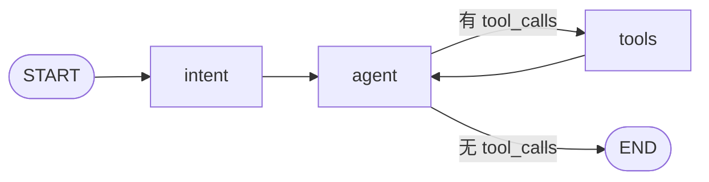

# 矿权日报 Agent

按 MCP 协议取数、用 LangGraph 编排的矿业分析助手。

输入「给我生成一份关于 Pilbara 锂矿的今日简报」，它会自己检索新闻、下载年报抽储量表、
查行情，然后输出一份带出处引用的 Markdown 简报。

**上手跑：[RUN.md](RUN.md)**

---

## 一、Graph 介绍



三个节点，代码在 `agent.py` 的 `build_graph()`。

### `intent` —— 判断意图 + 改写输入

用模型看最近几轮对话和用户最新一句话，输出一个 JSON：

```json
{"needs_data": true/false, "rewritten": "改写后的一句话"}
```

- **`needs_data`**：这句需要外部数据吗？要价格 / 新闻 / 储量 / 简报 → `true`；
  打招呼、闲聊、问能力 → `false`
- **`rewritten`**：把这句话改写成**自包含的请求** —— 指代词还原、省略补全。
  实测：上文问过碳酸锂，这轮只说「它今年最低多少」，「它」会被还原成「碳酸锂」

**为什么单独做一个节点**：一开始只有 `agent` + `tools`，模型在连续对话里会被上文带偏 ——
上一轮问过铁矿石走势，这一轮只说「你好」，它又去调了一遍 `get_trend(铁矿石)`。
**光在系统提示里写「打招呼别调工具」压不住**，因为问题出在对上文的理解。所以拆出来先判一次。

两个细节：

- 判断结果**不写进 `messages`**（自定义的 `AgentState` 多两个字段），只在 `agent` 节点里
  临时替换最后一条用户消息 —— 否则每轮都会往历史里塞一条内部消息
- 判不出来时一律按 `needs_data=true` 走：宁可多调一次工具，也不要误判成闲聊而答不出。
  纯问候（`你好` / `谢谢`）走短路，不再花一次模型调用

### `agent` —— 调模型

按 `needs_data` 选模型：为 `true` 时用**绑定了工具**的模型，为 `false` 时用**裸模型**。
寒暄那类从机制上就不可能发起工具调用，不是靠提示词求它自觉。

### `tools` —— 执行工具

LangGraph 的 `ToolNode`，执行模型要调的工具。工具在**启动时**从 3 个 MCP server 一次性加载。

### 工具怎么从 MCP 到 LangGraph

用 FastMCP 的 `Client` 把 3 个 server 拉起来，`list_tools()` 拿到 9 个工具，
再逐个包成 LangChain 的 `StructuredTool` —— 用 MCP 的 `input_schema` 动态生成 pydantic 模型
当 `args_schema`。

工具名是 FastMCP 给的 `{server}_{tool}`（如 `lme-price_get_price`），
这个格式本来就是合法的 OpenAI 函数名，不需要改写。

> ⚠️ **为什么不用官方的 `langchain-mcp-adapters`**：它要求 `mcp<2.0.0`，
> 而 fastmcp 4 要求 `mcp>=2.0.0`，两者**硬冲突**。工具转换只能手写。

---

## 二、三个 MCP server

都用 **FastMCP** 封装，**都不调用 LLM、不依赖外部服务**（没有向量库、没有嵌入模型），
唯一的运行时状态是一个 SQLite 文件加一个 HTTP 缓存目录。所以每一个都能**单独挂进
Claude Desktop 跑起来**。

### `mining-news` — 矿业新闻

| 工具 | 作用 |
|---|---|
| `search(query, days, limit, live)` | 检索近 N 天新闻 |
| `fetch_article(url)` | 抓单篇正文 |
| `corpus_stats()` | 查看本地库规模（诊断用） |

两条互补通道：**常驻 RSS**（mining.com、The Northern Miner，翻页可回溯数年）+
**按查询实时抓 Google News**（中英各一路）。

### `mineral-pdf` — 技术报告储量抽取

| 工具 | 作用 |
|---|---|
| `extract_resources(pdf_url)` | 从 NI 43-101 / JORC 报告抽 Indicated / Inferred 储量表 |
| `known_reports(company)` | 查已登记的报告索引 |

抽出来的是矿石量（Mt）、品位（g/t 或 %）、金属量（oz 或 t）。

### `lme-price` — 价格行情

| 工具 | 作用 |
|---|---|
| `get_price(commodity, date, verify)` | 某品种价格，可传历史日期 |
| `get_trend(commodity, days)` | 近 N 日走势 + 区间统计 |
| `list_commodities()` | 可查的品种（8 个） |
| `list_sources()` | 数据源及其权威性等级 |

覆盖上期所（沪铜 / 沪锌 / 沪镍）、广期所（碳酸锂）、LME（伦铜 / 伦锌 / 伦镍）、
大商所（铁矿石）。

---

## 三、数据查询方式

### 新闻：四级召回阶梯

```
① 精确召回（AND，带中英术语扩展）
      ├─ ≥3 条 → 返回
      ▼ <3 条
② 按查询实时抓 Google News（中英两路）
③ 再精确召回 → 有则返回
      ▼ 仍无
④ 宽松召回（OR，标注 low_confidence）
      ▼ 仍无
⑤ 放宽时间窗（标注「这不是近期新闻」）
```

**② 必须在 ④ 前面**：先宽松召回的话，OR 凑出的几条弱相关结果会让上游误以为
「已经召回充分」，从而跳过真正该取的数据源。这个坑实际踩过 —— 搜 `Pilbara Minerals`
返回了 6 条只含 `minerals` 的无关文章，Google News 补抓根本没触发。

**跨语言**靠两件事：FTS5 索引做 CJK 逐字空格化（`锂矿` → `锂 矿`，用短语查询等价子串匹配），
加上一份中英术语词典做扩展（`锂矿` → `OR lithium OR spodumene`）。都是确定性词表，不调模型。

### 新闻：两道去重

| 关卡 | 键 | 为什么 |
|---|---|---|
| 一 | `url` | 同一源重复抓取 |
| 二 | `title_key`（归一化标题） | **同一条报道在 Google News 中英两路、或媒体 RSS 与聚合源之间 URL 不同** —— 实测 592 篇里有 22 组同标题重复，白占召回名额 |

标题重复时**保留能抓正文的直连源**（Google News 聚合源只有标题摘要）。

另有一道垃圾过滤：Google News 偶尔会带 SEO 污染标题（实测出现过「AG捕鱼王电子」前缀
挂在一条真新闻上），入库时丢掉。

### 储量：pdfplumber 不行，改成按坐标重建表格

不用 `extract_tables()`：实测两份真实报告都不行 —— 无框线的（Implats AIF）返回 **0 张表**，
有框线的（Pilbara 年报）检测到了但**标签列被丢掉**。

改成**数据驱动定列**：词按纵坐标聚成行 → 找含 `Tonnes` + `Grade` 的表头行 →
把这些行里**数字的横坐标聚类成列** → 每列取横向邻近的表头词判定语义与单位。

第 3 步是关键。真实报告里表头词挨得极近（Pilbara 相邻列中心只差 40pt），
按表头词间距合并会糊成一团；按数据数字的横坐标分列则天然分开。

### 价格：官方优先 + 双源冗余

| 品种 | 源 | 权威性 |
|---|---|---|
| 沪铜 / 沪锌 / 沪镍 | 上期所官网 | **official**，支持历史 |
| 碳酸锂（最新价） | 广期所官网 | **official**，仅最新 |
| 碳酸锂（历史序列） | 东财 | relay |
| LME 铜锌镍 / 铁矿石 | 东财 → 新浪 | relay |

**关键设计：历史日行情文件是不可变的** —— 2026-10-08 收盘后那份文件的内容永不再变。
所以历史日期缓存 10 年（等于永久）、今天用短 TTL。30 日走势的代价因此是
「首次约 20 次请求，之后全免费」，缓存自然累积成本地历史库。

**为什么还需要转载源**：LME 官网 403、大商所 412，这两个没有可用的官方源。
东财本身也有限流（实测整个 IP 被限到 `code=000`），所以做了三层防护：
快速失败（8 秒超时）→ 磁盘缓存 → 新浪作第二源 → 陈旧缓存兜底（标注已过期）。

### 数据源权威性：每个返回值都带 `source_tier`

同一句「沪铜 110,260 元/吨」，从交易所官网取的和从行情门户取到的，可信度不一样。
不标出来的话读的人无法判断该信几分。

| 等级 | 含义 |
|---|---|
| `official` | 交易所 / 公司官网一手数据，可直接引用 |
| `relay` | 门户转载，数值通常一致但可能滞后 |
| `substitute` | 用相近但**不同**的东西顶替，**不等价** |

**实测拿不到的四个源**（原因记在 `cache.py` 的 `SOURCES` 里，不是漏了是评估过）：
LME 官网（403 地域封锁）、上海钢联价格指数（401 需签名认证与订阅）、
大商所官网（412 反爬）、S&P Global（403）。

因此**铁矿石用大商所期货替代钢联现货指数**（标 `substitute`），**LME 走转载源**（标 `relay`）。

### 一条贯穿所有取数的纪律：拿不到就说拿不到

- 新闻正文抓不到 → `fetch_article` 返回 `full_text_unavailable` 并说明原因，
  **不把 Google 的跳转页当正文**
- 储量表识别不出来 → `no_table_found` + 原因，**不返回半成品、不拿正文段落里的数字凑表**
- 储量表没有金属量列 → 用 `吨位 × 品位` 推算，但结果放 `contained_derived` 字段，
  **与抽取值分开**（抽到的是原文事实，推算是我们的算术）

### 一个真实的坑：广期所官方接口忽略日期参数

```
请求 20260801 -> 主力 lc2701 收盘 117300
请求 20260901 -> 主力 lc2701 收盘 117300      ← 一模一样
请求 20260930 -> 主力 lc2701 收盘 117300
```

拿它拼历史序列会得到一条**首末相同的假水平线** —— 比没有数据更糟，因为它看起来像真的。
更隐蔽的是 `get_price('碳酸锂', '2026-09-30')` 会把**今天的数据标成 9-30** 返回：
日期是错的、数字看着完全正常。

对照实测上期所**真的按日期取历史**，确认差异后加了 `history: True/False` 标记
（实测得出不是猜的），`history=False` 的源只用于最新价，历史自动降级到转载源。

---

## 四、使用方式

**见 [RUN.md](RUN.md)** —— 里面有本地跑、Docker 拉镜像跑、接到 Claude Desktop 三种方式，
以及全部命令行参数。

两种入口：

| 入口 | 命令 | 说明 |
|---|---|---|
| 网页 | `python web.py` → `localhost:8000` | 左边对话、右边数据预览（简报 / 新闻库 / 价格 / 数据源） |
| 命令行 | `python agent.py` | 交互式聊天 |

API Key 可以直接在网页上填，不需要 `.env`。

---

## 目录结构

```
mineral-daily-brief/
├── cache.py            数据缓存层（三个 server 共同依赖）
│                       ├─ 数据源登记表（权威性等级）
│                       ├─ HTTP 取数：浏览器 UA、重试、磁盘缓存、陈旧兜底
│                       └─ SQLite + CJK 感知 FTS5
├── news_server.py      mining-news MCP（FastMCP）+ 中英矿业术语词典
├── pdf_server.py       mineral-pdf MCP（FastMCP）+ 按坐标重建表格
├── price_server.py     lme-price MCP（FastMCP）+ 品种表 + 四个价格源
├── agent.py            LangGraph 三节点（intent / agent / tools）+ MCP 工具加载
├── web.py              网页后端（复用 agent 的图 + 数据预览 + 简报存档）
├── index.html          网页前端（一页，无构建步骤）
├── Dockerfile / docker-compose.yml
├── .github/workflows/docker-publish.yml   推到 main 自动构建并推 GHCR
├── pyproject.toml / .env.example / .gitignore / .dockerignore
├── RUN.md
└── data/               运行时生成：SQLite 库 + HTTP 缓存 + 简报存档
```
